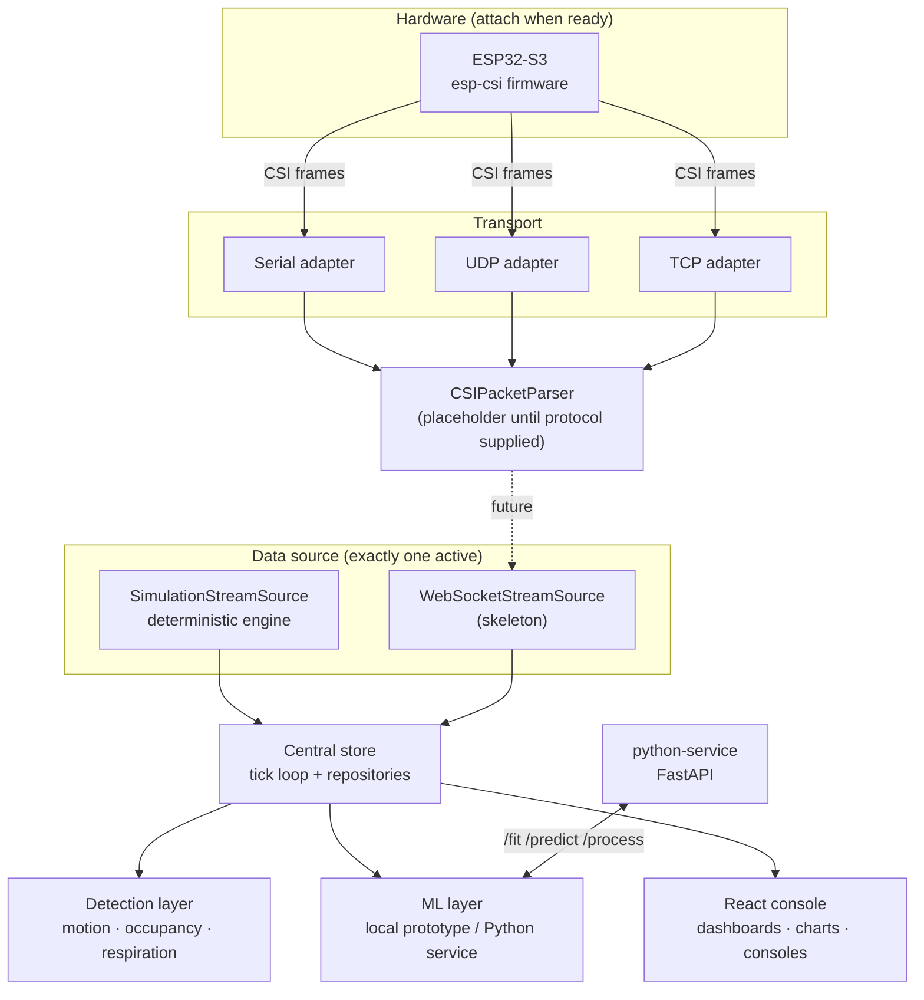

# WiFiSense Lab

**Professional Wi-Fi Channel State Information (CSI) research & monitoring platform.**

`v1.0.0` · `15/15 phases` · `React 18 + TypeScript` · `FastAPI` · `ESP32-S3 ready`

WiFiSense Lab is a browser-based control center for experimenting with Wi-Fi CSI —
human presence detection, motion detection, activity recognition, signal visualization,
dataset recording, machine learning, and experimental respiration sensing. It ships with a
**deterministic simulation engine** so every module works immediately, and exposes clean
adapter interfaces so real hardware (ESP32-S3 / esp-csi nodes) can be attached without
rewriting a single module.

> ⚠️ **Honesty contract.** Simulated data is always labeled `SIMULATED`. The console never
> presents synthetic frames as hardware measurements, never invents packet protocols, and
> reports *unreliable* instead of guessing when an estimate cannot be trusted.

---

## Contents

- [Highlights](#highlights)
- [Phase roadmap — all delivered](#phase-roadmap--all-delivered)
- [Architecture](#architecture)
- [Quick start](#quick-start)
- [Python processing service](#python-processing-service)
- [Simulation vs. live hardware](#simulation-vs-live-hardware)
- [Self-test suite](#self-test-suite)
- [Hardware integration (ESP32-S3)](#hardware-integration-esp32-s3)
- [Dataset formats](#dataset-formats)
- [Persistence](#persistence)
- [Project structure](#project-structure)
- [Security notes](#security-notes)
- [Extension points](#extension-points)
- [License](#license)

---

## Highlights

| Capability | Detail |
|---|---|
| **Deterministic simulation** | Seeded `mulberry32` engine — same seed ⇒ byte-identical tick sequence. Multipath baseline × slow fading × motion perturbation, per-subcarrier spectra, phase drift/Doppler, per-room scenario state machines. |
| **Live CSI console** | Amplitude/phase scopes, per-subcarrier traces, spectral **waterfall**, RSSI/variance/motion stats, freeze/clear/export (CSV/JSON with provenance headers). |
| **Signal analysis** | Moving-average, median, low/high/band-pass filters; radix-2 FFT with peak detection; phase unwrapping; feature statistics — pure functions mirrored in Python for parity. |
| **Detection** | Baseline signal motion detector (hysteresis, configurable threshold/window) and a 5-state occupancy engine (`EMPTY / OCCUPIED / MOTION / STATIONARY / UNKNOWN`) driven by empty-room baselines you capture. |
| **Datasets** | Record/pause/stop, inline label markers, notes, 9 activity categories; search/filter/sort browser; viewer with amplitude replay; CSV/JSON export; file importer that **refuses unknown binary formats**. |
| **Machine learning** | Classical models via FastAPI (Random Forest, SVM, Logistic Regression); honest in-browser prototype fallback; live inference with confidence timeline. |
| **Room map** | Building/floor/room plans, draggable sensor placement, occupancy tinting, motion pulses — person markers are *approximate*, never claimed localization. |
| **Hardware plumbing** | Transport adapters (serial/UDP/TCP), parser stage, Web Serial monitor, fleet health — all placeholder-safe until the esp-csi frame layout is supplied. |
| **Respiration (experimental)** | 0.08–0.6 Hz band-pass → FFT → peak search. Bannered `EXPERIMENTAL · NOT A MEDICAL DEVICE`; unreliable windows explain *why*. |

## Phase roadmap — all delivered

| # | Module | Status |
|---|---|---|
| 1 | Professional dashboard + simulation engine | ✅ |
| 2 | Sensor fleet management (CRUD, rooms, connection test) | ✅ |
| 3 | Live CSI visualization (scopes, waterfall, export) | ✅ |
| 4 | Signal analysis (filters, FFT, features) | ✅ |
| 5 | Motion detection (baseline signal detector) | ✅ |
| 6 | Presence / occupancy engine + baselines | ✅ |
| 7 | Dataset recorder + browser + import | ✅ |
| 8 | Machine learning interface + activity console | ✅ |
| 9 | Python processing service (FastAPI) | ✅ |
| 10 | ESP32-S3 hardware adapters | ✅ |
| 11 | Serial monitor (Web Serial) | ✅ |
| 12 | Multi-sensor network + fleet health | ✅ |
| 13 | Room map + placement | ✅ |
| 14 | Event engine | ✅ |
| 15 | Respiration research module | ✅ |

## Architecture



**Key invariant:** the UI and detection layers only ever consume the telemetry contract
(`TelemetryPoint`, `SensorSim`, `RoomSim`). Swapping the simulation source for a live
WebSocket source changes nothing downstream.

## Quick start

```bash
# 1. Install & run the web console
npm install
npm run dev          # http://localhost:5173

# 2. Production build
npm run build        # → dist/ (single self-contained index.html)
```

On first boot the console:

1. Generates a deterministic 4-node fleet (seed `4242`) streaming synthetic CSI.
2. Runs the **self-test suite** (see [Settings → Self-Test Suite](#self-test-suite)).
3. Persists fleet configuration, datasets, baselines and map layout to `localStorage`.

> A browser is **not** an automatic CSI receiver. CSI requires supported hardware,
> firmware and drivers — see [Hardware integration](#hardware-integration-esp32-s3).

## Python processing service

Optional but recommended for real DSP/ML workloads.

```bash
cd python-service
python3 -m venv .venv && source .venv/bin/activate
pip install -r requirements.txt
uvicorn app:app --host 0.0.0.0 --port 8000
```

| Endpoint | Purpose |
|---|---|
| `GET /health` | Liveness + fitted-model inventory (the console probes this) |
| `POST /process` | Filter a CSI amplitude series (parity with browser DSP) |
| `POST /features` | Sliding feature windows over raw samples |
| `POST /fit` | Train RF / SVM / Logistic Regression on labeled windows |
| `POST /predict` | Classify one feature window → `{prediction, confidence, distribution}` |

In the console: **Machine Learning → Python ML Service → Connect**. Until the service
answers, the console falls back to the clearly-labelled local prototype.

## Simulation vs. live hardware

| | Simulation mode | Live hardware mode |
|---|---|---|
| Source | In-process deterministic engine | `/ws/csi` gateway (adapter required) |
| Labeling | Every chart/export tagged `SIMULATED` | Never relabeled as simulated |
| With no adapter | Streams synthetic CSI | Shows *"No live CSI source connected."* |

**Never mix the two.** The mode switch is explicit in Settings, and exports carry an
explicit `provenance` block so downstream tools can't mistake synthetic frames for
measurements.

## Self-test suite

Runs automatically at boot and on demand (**Settings → Self-Test Suite**). Covers:

- Engine seeded determinism (200 ticks) and numeric bounds (950 ticks)
- Motion score tracking human activity
- All DSP filters, FFT peak recovery, phase unwrap, normalisation
- Motion detector hysteresis and baseline estimation
- Occupancy state-machine transitions (EMPTY/MOTION/STATIONARY/UNKNOWN)
- Dataset round-trip, repository validation, fleet rebuild safety
- ML classifier determinism, respiration tone recovery, importer refusals

Results are also written to **System Logs**.

## Hardware integration (ESP32-S3)

```
ESP32-S3 (esp-csi) → transport adapter (serial/udp/tcp)
    → CSIPacketParser → CSIFrame → signal pipeline → detection
```

- Adapters and the parser are **explicit placeholders** — the binary esp-csi frame
  layout has not been supplied and will not be guessed.
- A documented JSON-line debug format is parsed today so firmware bring-up can start.
- The **Serial Monitor** uses Web Serial in Chromium (`/dev/ttyUSB0`, `/dev/ttyACM0`);
  elsewhere, use the Python `pyserial` bridge.

## Dataset formats

Exported CSV columns: `t_s, amplitude, phase_rad, rssi_dbm, variance, motion_score`,
with label markers appended as `# label @ <t>s :: <label>` comments. JSON exports wrap
rows with a `meta` block (sensor, room, seed, sample rate, **provenance**).

The importer accepts these CSV/JSON exports and **refuses** NPZ/unknown binaries with an
explanation.

## Persistence

| Key | Content |
|---|---|
| `wifisense.sensors.v1` | Fleet configuration |
| `wifisense.baselines.v1` | Empty-room baselines |
| `wifisense.datasets.v1` | Dataset index + blobs |
| `wifisense.map.v1` | Floor plan + sensor placement |
| `wifisense.motion.v1` | Motion detector settings |

The repository layer is interface-driven, so SQLite/PostgreSQL can replace
`localStorage` behind the same API.

## Project structure

```
src/
  charts/        LineChart · SpectrumChart · WaterfallChart · FFTChart · CaptureChart
  components/    ui kit · TopNav · Sidebar · modals · CsiImporter
  pages/         16 routed consoles (Dashboard → Respiration → Docs)
  processing/    dsp · detectors · occupancy · respiration   (pure, testable)
  services/      repositories · streamAdapter · processor · ml · transport
  simulation/    engine · rng                                (deterministic)
  state/         store                                       (single source of truth)
  tests/         selftest                                    (boot-run suite)
  utils/         format · signal · exporter · csiImport
python-service/  FastAPI app + processors + models + utils
```

## Security notes

- No secrets in frontend code; service URLs are operator-entered.
- All user inputs (labels, filenames, sensor fields) validated and sanitized.
- CORS on the Python service restricted to the console origin.
- Unknown binary inputs are refused, never parsed speculatively.

## Extension points

MQTT · PostgreSQL · Docker · Prometheus/Grafana · auth/RBAC · multi-site — each has a
clean seam (source adapter, repository interface, event bus) prepared but intentionally
unimplemented.

## License

MIT — see [CONTRIBUTING.md](CONTRIBUTING.md) for the phased development rules that keep
this platform stable as it grows.
